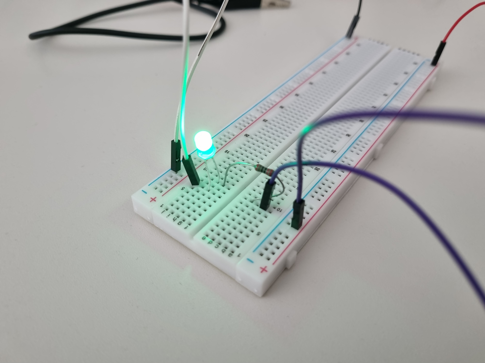
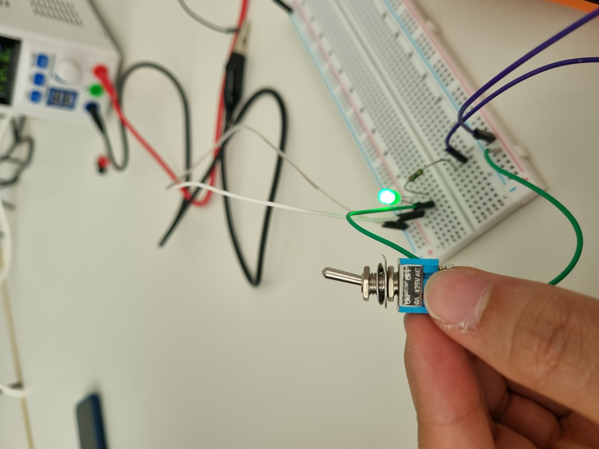
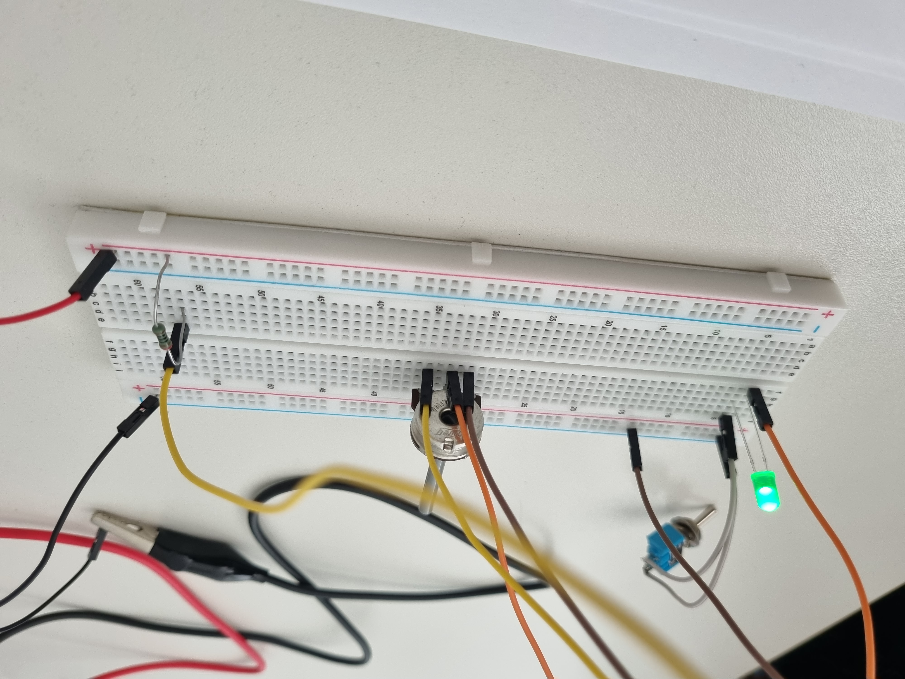
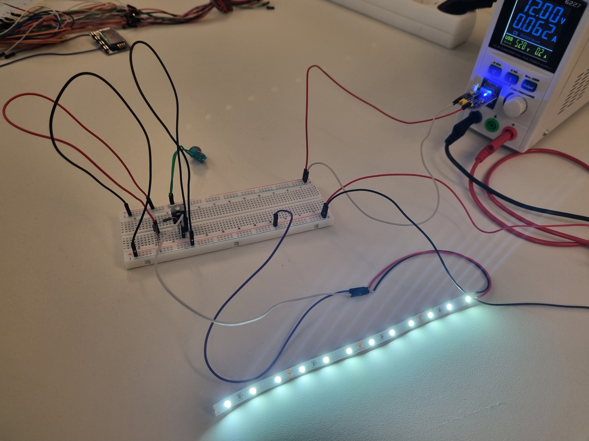
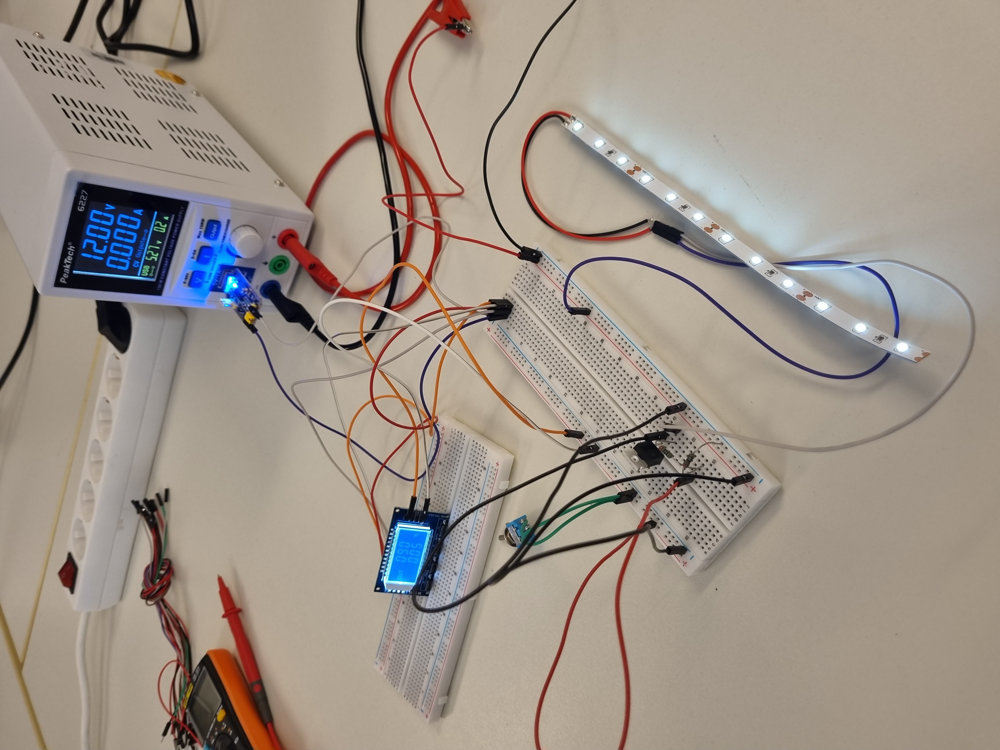
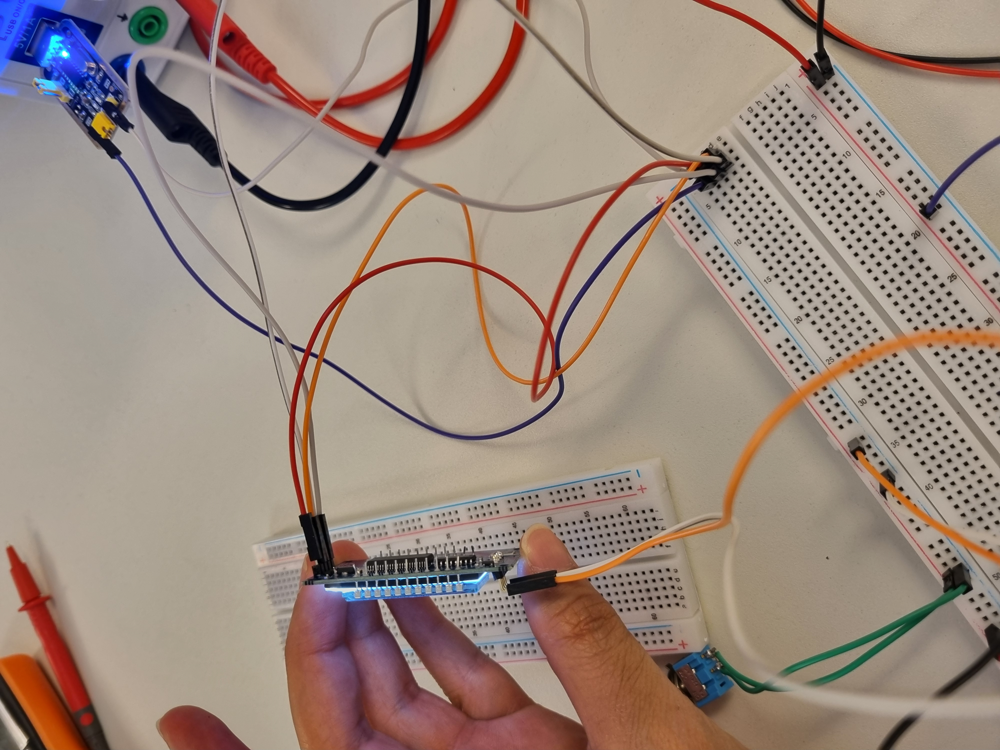

# Portfolio: Digital Design & Fabrication
## Exercise 1: Electrical Circuits

### Task 1.1: Simple LED Circuit
First, we prepared the electrical components and selected the appropriate resistors. The power supply was set to 5V and 1A. We started by reading the schematic and assembling the parts on the breadboard. 

During our first attempt, we faced two main challenges. First, we had forgotten how the positive, negative, and ground rails connect inside the breadboard cells. We initially assumed the right and left power rails were internally connected. Second, the LED did not turn on because we had connected it in reverse, forgetting that the longer pin (anode) must be connected to the positive side. We quickly identified and fixed these problems, and the circuit worked perfectly.

Next, we measured the voltage across R1 ($V_{1}$) and the LED ($V_{LED}$).

| R1 [Ω] | Measured $V_{1}$ [V] | Measured $V_{LED}$ [V] |
| :---: | :---: | :---: |
| 220 | 2.16 | 2.76 |
| 1000 | 2.50 | 2.47 |
| 4700 | 2.70 | 2.30 |

**Observations:** We observed that the voltage across R1 (220 Ω) was lower compared to when we used resistors with higher resistance. When we replaced the resistor with higher resistance ones (1 KΩ and 4.7 KΩ), the measured voltage of the LED dropped. However, the visual effect of the different resistors on the LED's brightness was not very noticeable to us.

---

### Task 1.2: Switchable LED Circuit
In this task, we added a switch to the base circuit as instructed in the schematic. Initially, the switch did not seem to work properly based on its labels. We soon realized that the "ON" and "OFF" printed labels were reversed, likely due to a manufacturing defect. 

Despite this, the primary function was intact, and it successfully turned the LED on and off. As requested, we also tested connecting the switch in the opposite direction. As expected, since a standard mechanical switch is not polarized, we observed no difference in its operation.

---

### Task 1.3: Dimmable LED Circuit
Wiring this circuit was slightly more challenging as we initially got confused about connecting the potentiometer's wiper (the middle pin) to the rest of the circuit. After reviewing the schematic, we successfully routed the connections and achieved the correct result. We then measured $V_{LED}$ and $V_{2}$ (voltage across the potentiometer) at different brightness levels.

| Position | $V_{LED}$ [V] | $V_{2}$ [V] |
| :--- | :---: | :---: |
| a) full brightness | 3.00 | 4.95 |
| b) dimmed | 2.21 | 2.23 |
| c) OFF | 0.0074 (7.4 mV) | 0.0062 (6.2 mV) |

**Observations:** We observed that rotating the potentiometer changes its resistance, which in turn alters the brightness of the LED. As the resistance of the potentiometer increased, $V_{LED}$ and $V_{2}$ decreased, which restricted the current and caused the LED to dim. A notable characteristic of this relationship is that it is not perfectly linear; once $V_{2}$ drops below the LED's minimum forward voltage threshold, the LED turns off completely (Position C).

---

### Task 2.1: Switchable LED Strip
The assembly of this circuit was straightforward, and we successfully built it without any major challenges. 

**Observations & Principle of Operation:** In this circuit, the switch controls the Gate-Source voltage ($V_{GS}$) of the transistor. When the switch is closed, a 5V signal from the USB is applied to the Gate. This small control voltage turns the MOSFET "ON", allowing a much larger current to flow from the Drain to the Source ($V_{DS}$), which powers the 12V LED strip. The transistor effectively acts as an electronic bridge, allowing a safe, low-voltage 5V circuit to control a higher-power 12V load while keeping their power domains isolated, sharing only a common ground. Also, we measured the voltage on ($V_{GS}$) which was almost 5.2V and 11.7V on ($V_{DS}$).

---

### Task 2.2: Dimmable LED Strip
In this task, we replaced the manual switch with a PWM (Pulse Width Modulation) signal generator set to 90Hz to control the MOSFET gate. 

**A) Adjusting Duty Cycle (D):**
We tested the LED strip at duty cycles of 2%, 15%, 40%, 75%, and 100%. We observed a direct relationship: as the duty cycle increases, the perceived brightness of the LED strip also increases. 

*Comparison with Task 1.3:* In Task 1.3, we used a potentiometer to dim the LED. The potentiometer works by resisting the flow of electricity, which drops the voltage and makes the light dimmer. The PWM method is different. Instead of dropping the voltage, PWM simply turns the full 12V power ON and OFF very quickly. The "Duty Cycle" just controls how long the power stays ON compared to OFF. Because it blinks so fast, our eyes blend the light together, making it look like a smooth, dimmed light.

**B) Adjusting Switching Frequency (f):**
Keeping the duty cycle at 50% ($D=0.5$), we tested frequencies of 5Hz, 25Hz, 45Hz, and 100Hz. At lower frequencies (like 5Hz, 25Hz and 45Hz), the flickering of the LED strip was highly visible and slow. As we increased the frequency, the flicker became faster. Around 55Hz, the flickering stopped being visible to the naked eye due to the human eye's persistence of vision. 

To investigate further, we recorded the LED strip using our smartphone's slow-motion camera at 240 FPS. Using this method, we were able to clearly capture and verify the rapid ON/OFF flickering even at 100Hz.

| Dimmable LED Strip 2.2 | SWM Wire Connections |
| :---: | :---: |
|  |  |
