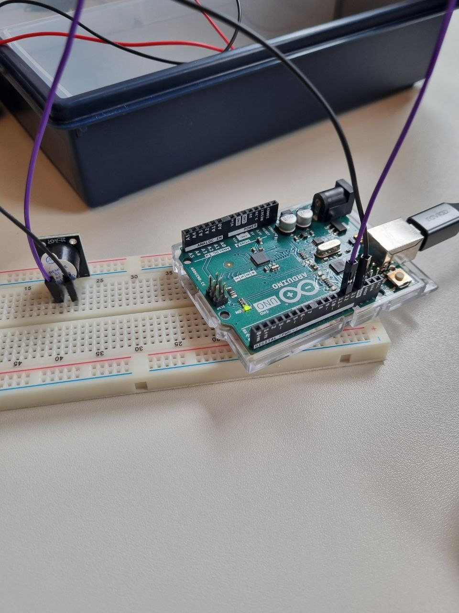
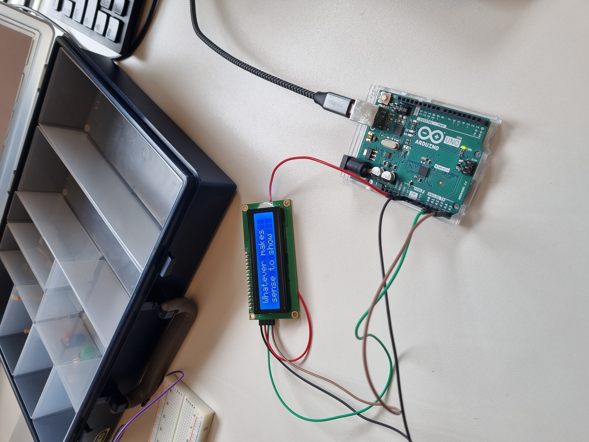
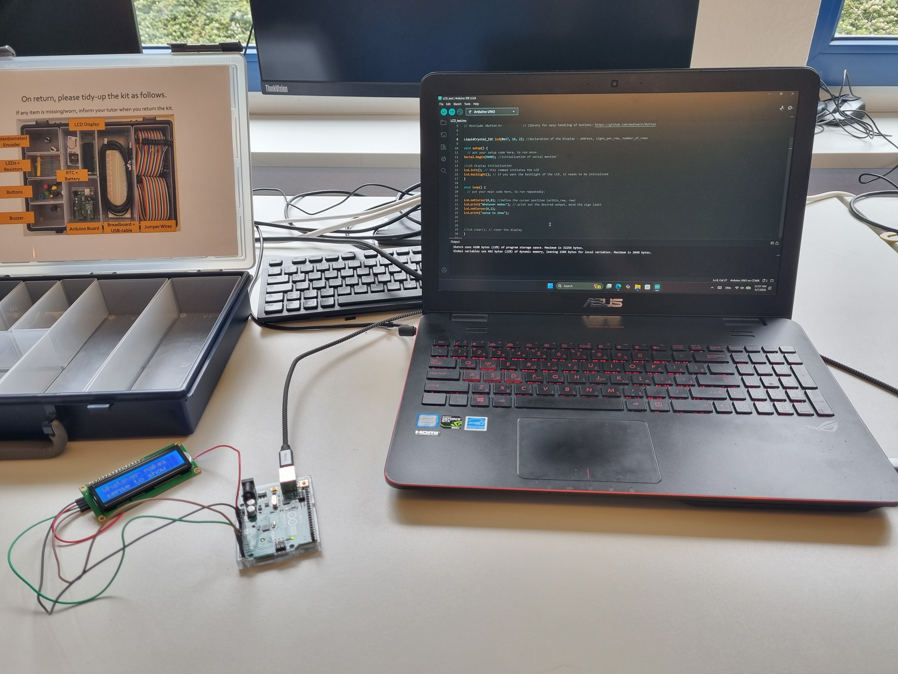
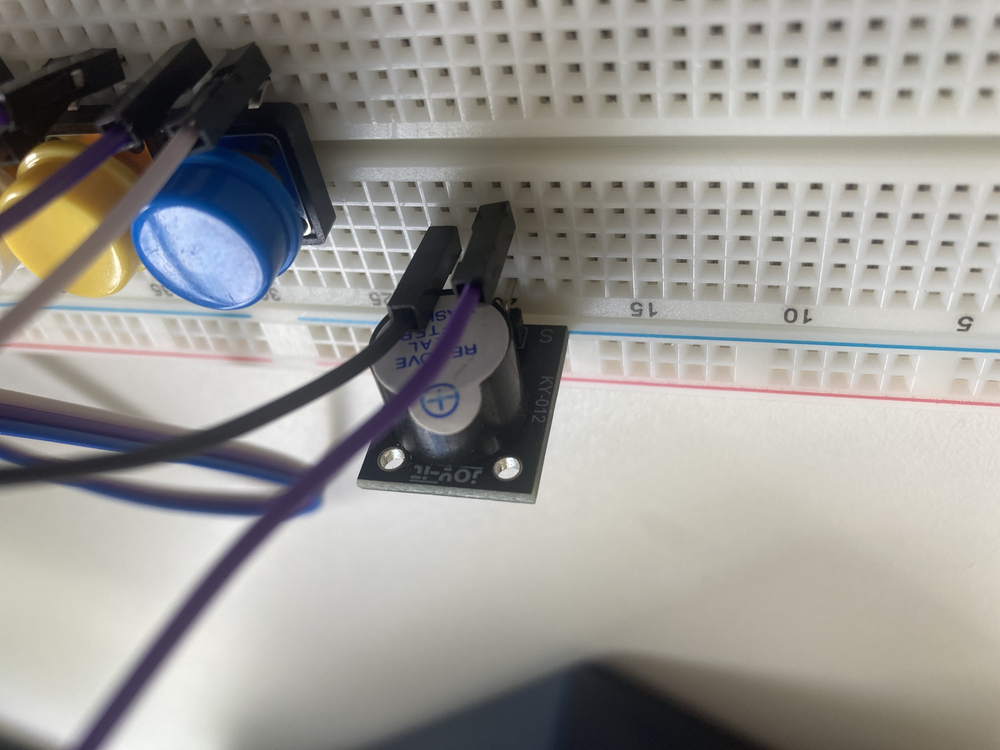
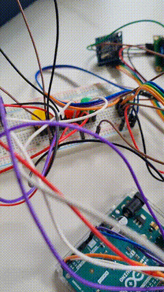
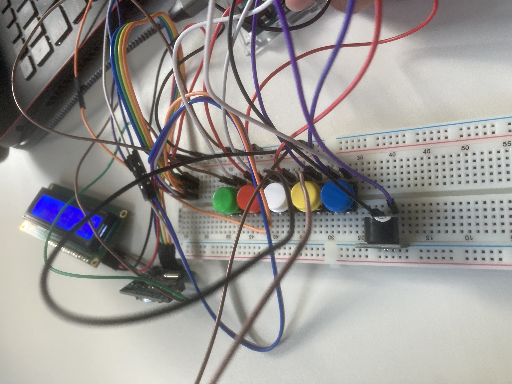
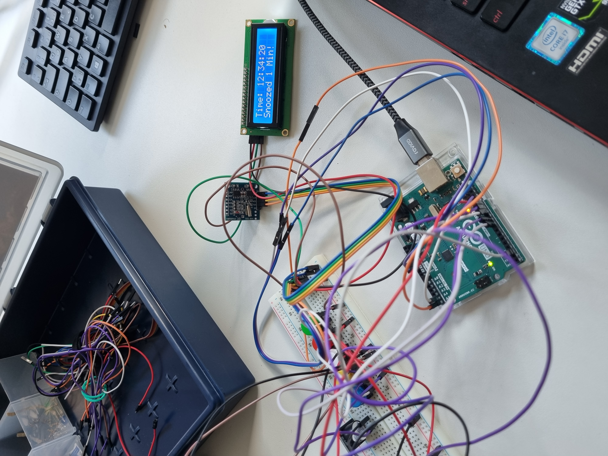

# Portfolio: Digital Design & Fabrication
## Exercise 1: Electrical Circuits

### Task 1.1: Simple LED Circuit
First, we prepared the electrical components and selected the appropriate resistors. The power supply was set to 5V and 1A. We started by reading the schematic and assembling the parts on the breadboard. 

During our first attempt, we faced two main challenges. First, we had forgotten how the positive, negative, and ground rails connect inside the breadboard cells. We initially assumed the right and left power rails were internally connected. Second, the LED did not turn on because we had connected it in reverse, forgetting that the longer pin (anode) must be connected to the positive side. We quickly identified and fixed these problems, and the circuit worked perfectly.


Next, we measured the voltage across R1 ($V_{1}$) and the LED ($V_{LED}$).

| R1 [Ω] | Measured $V_{1}$ [V] | Measured $V_{LED}$ [V] |
| :---: | :---: | :---: |
| 220 | 2.16 | 2.76 |
| 1000 | 2.50 | 2.47 |
| 4700 | 2.70 | 2.30 |

**Observations:** We observed that the voltage across R1 (220 Ω) was lower compared to when we used resistors with higher resistance. When we replaced the resistor with higher resistance ones (1 KΩ and 4.7 KΩ), the measured voltage of the LED dropped. However, the visual effect of the different resistors on the LED's brightness was not very noticeable to us.

---

### Task 1.2: Switchable LED Circuit
In this task, we added a switch to the base circuit as instructed in the schematic. Initially, the switch did not seem to work properly based on its labels. We soon realized that the "ON" and "OFF" printed labels were reversed, likely due to a manufacturing defect. 

Despite this, the primary function was intact, and it successfully turned the LED on and off. As requested, we also tested connecting the switch in the opposite direction. As expected, since a standard mechanical switch is not polarized, we observed no difference in its operation.


---

### Task 1.3: Dimmable LED Circuit
Wiring this circuit was slightly more challenging as we initially got confused about connecting the potentiometer's wiper (the middle pin) to the rest of the circuit. After reviewing the schematic, we successfully routed the connections and achieved the correct result. We then measured $V_{LED}$ and $V_{2}$ (voltage across the potentiometer) at different brightness levels.

| Position | $V_{LED}$ [V] | $V_{2}$ [V] |
| :--- | :---: | :---: |
| a) full brightness | 3.00 | 4.95 |
| b) dimmed | 2.21 | 2.23 |
| c) OFF | 0.0074 (7.4 mV) | 0.0062 (6.2 mV) |

**Observations:** We observed that rotating the potentiometer changes its resistance, which in turn alters the brightness of the LED. As the resistance of the potentiometer increased, $V_{LED}$ and $V_{2}$ decreased, which restricted the current and caused the LED to dim. A notable characteristic of this relationship is that it is not perfectly linear; once $V_{2}$ drops below the LED's minimum forward voltage threshold, the LED turns off completely (Position C).


---

### Task 2.1: Switchable LED Strip
The assembly of this circuit was straightforward, and we successfully built it without any major challenges. 

**Observations & Principle of Operation:** In this circuit, the switch controls the Gate-Source voltage ($V_{GS}$) of the transistor. When the switch is closed, a 5V signal from the USB is applied to the Gate. This small control voltage turns the MOSFET "ON", allowing a much larger current to flow from the Drain to the Source ($V_{DS}$), which powers the 12V LED strip. The transistor effectively acts as an electronic bridge, allowing a safe, low-voltage 5V circuit to control a higher-power 12V load while keeping their power domains isolated, sharing only a common ground. Also, we measured the voltage on ($V_{GS}$) which was almost 5.2V and 11.7V on ($V_{DS}$).


---

### Task 2.2: Dimmable LED Strip
In this task, we replaced the manual switch with a PWM (Pulse Width Modulation) signal generator set to 90Hz to control the MOSFET gate. 

**A) Adjusting Duty Cycle (D):**
We tested the LED strip at duty cycles of 2%, 15%, 40%, 75%, and 100%. We observed a direct relationship: as the duty cycle increases, the perceived brightness of the LED strip also increases. 

*Comparison with Task 1.3:* In Task 1.3, we used a potentiometer to dim the LED. The potentiometer works by resisting the flow of electricity, which drops the voltage and makes the light dimmer. The PWM method is different. Instead of dropping the voltage, PWM simply turns the full 12V power ON and OFF very quickly. The "Duty Cycle" just controls how long the power stays ON compared to OFF. Because it blinks so fast, our eyes blend the light together, making it look like a smooth, dimmed light.

**B) Adjusting Switching Frequency (f):**
Keeping the duty cycle at 50% ($D=0.5$), we tested frequencies of 5Hz, 25Hz, 45Hz, and 100Hz. At lower frequencies (like 5Hz, 25Hz and 45Hz), the flickering of the LED strip was highly visible and slow. As we increased the frequency, the flicker became faster. Around 55Hz, the flickering stopped being visible to the naked eye due to the human eye's persistence of vision. 

To investigate further, we recorded the LED strip using our smartphone's slow-motion camera at 240 FPS. Using this method, we were able to clearly capture and verify the rapid ON/OFF flickering even at 100Hz.

| Dimmable LED Strip 2.2 | SWM Wire Connections |
| :---: | :---: |
|  |  |

---

## Exercise 2: Arduino-Based Alarm Clock with Snooze Function

This exercise focused on building a functional Arduino alarm clock using an LCD screen, RTC module, buzzer, and push-button controls. The final version displays the current time, allows alarm control through buttons, and includes a snooze function.

---

### Task 1: Connecting the Buzzer

First, we tested the buzzer as the alarm output. We placed the buzzer on the breadboard and connected it to the Arduino digital output pin and ground. The Arduino itself was powered through a USB connection from the laptop USB port. The buzzer was controlled by changing the output state from LOW to HIGH. During testing, we manipulated the sequence and delay values of the buzzer and observed that changing these values changed the rhythm and timing of the sound. We also found that the buzzer did not necessarily need a resistor before it in our test setup, so it could be connected directly to a 5V digital output pin on the Arduino.

Code snippet used to test the buzzer output:

```cpp
const int buzzerPin = 8;

void setup() {
  pinMode(buzzerPin, OUTPUT);
}

void loop() {
  digitalWrite(buzzerPin, HIGH);
  delay(500);
  digitalWrite(buzzerPin, LOW);
  delay(500);
}
```

Buzzer test circuit connected to the Arduino Uno.

**Task Observation:** Many jumper wires made the circuit difficult to follow, so we tested the system in smaller blocks and checked connections one component at a time. Testing the buzzer separately helped us confirm that the alarm output worked before adding more parts to the circuit.



---

### Task 2: Connecting the LCD Screen

Next, we tested the 16x2 LCD screen using the I2C interface. This reduced the wiring to four connections: VCC, GND, SDA, and SCL. We connected the LCD VCC pin to the Arduino 5V pin, the LCD GND pin to the Arduino GND pin, SDA to A4, and SCL to A5 on the Arduino Uno.

Before running the LCD test code, we used the `I2C_scanner.ino` sketch to detect the LCD address. The scanner showed that our LCD address was `0x27`, so we used this address in the LCD code and successfully displayed text on the screen.

In the code part, we also had to install and include the required library for the LCD. For this display, we used the `LiquidCrystal_I2C` library with the following include line.

Important LCD code setting:

```cpp
#include <LiquidCrystal_I2C.h>

LiquidCrystal_I2C lcd(0x27, 16, 2);

void setup() {
  lcd.init();
  lcd.backlight();
  lcd.setCursor(0, 0);
  lcd.print("Whatever make sense to show");
}
```

LCD test showing a custom message on the display.

Arduino IDE and hardware setup during the LCD code test.

**Task Observation:** The I2C device needed the correct SDA and SCL wiring and also needed the correct device address. We used the I2C scanner to find the display address and then used `0x27` in the code. After checking the wiring and the address, the LCD displayed the test message correctly.

|  LCD connection |LCD connection code |
|:---:|:---:|
|  |  |


---

### Task 3: Expanding the Setup with a Real-Time Clock

After the LCD worked, we added the RTC module. Both the LCD and RTC use I2C communication, which means they both need the SDA and SCL pins on the Arduino. Since the Arduino Uno only has one SDA and one SCL connection, we made a parallel connection between the LCD, RTC, and Arduino, so both devices could share the same SDA and SCL pins. They also shared the same 5V and GND lines.

We used the `I2C_scanner.ino` sketch again to identify the RTC module address. The scanner showed the RTC address as `0x68`. After identifying the RTC address, we used the RTC_LCD partial test code to test the RTC module and display the current time on the LCD.

During the code testing, we found that the RTC module can be set to the current date and time at the beginning of the program. After the time is set, the RTC continues tracking it independently, and because it has its own separate battery, it can keep the time and date even when the Arduino is disconnected from power.

Code snippet used to read the RTC time:

```cpp
#include <RTClib.h>

RTC_DS3231 rtc;

void loop() {
  DateTime now = rtc.now();
  lcd.setCursor(0, 0);
  lcd.print(now.hour());
  lcd.print(":");
  lcd.print(now.minute());
}
```

RTC module connected with LCD and Arduino, displaying the current time.

**Task Observation:** The LCD and RTC both needed to use the same I2C communication lines. We kept the LCD and RTC on the same SDA and SCL lines and checked the display output after scanning the addresses. After completing the wiring and compiling the related RTC/LCD code, we observed the current time on the LCD. This confirmed that both I2C devices were connected correctly and could work together.

**RTC configuration**


**RTC functionality**
--


---

### Task 4: Using the Push Button

Before using the push button in the circuit, we first checked the button legs with a multimeter in continuity mode. This helped us understand which legs were internally connected. We realized that two of the button legs were connected together, and in our setup these were the legs that were farther away from each other on the breadboard layout.

To make the button easier to use, we placed it across the middle gap of the breadboard, as suggested by the manual-style setup. This position gave us better access to each button leg on separate breadboard blocks, which made the wiring clearer and reduced confusion during testing.

First, we added one push button to check the button press functionality and show the response on the display. After confirming that one button worked correctly, we added the rest of the push buttons to create a simple user interface for the alarm clock. The buttons were used for interaction with the system, such as changing values, stopping the alarm, and using the snooze function. After that, we used the button test code to check that each button press was detected correctly.

At the beginning, the buttons did not work reliably. To solve this, we changed the digital pins used on the Arduino, and after that the buttons started working correctly. We also had a grounding problem: even though we connected the grounds together on the breadboard and linked them to the Arduino GND, some parts of the circuit still did not work properly. We solved this by adding another GND connection from the other Arduino GND pin to the circuit, which made the ground connection more stable across the breadboard.

Code snippet used for the push button input:

```cpp
const int buttonPin = 2;

void setup() {
  pinMode(buttonPin, INPUT_PULLUP);
}

void loop() {
  int buttonState = digitalRead(buttonPin);
  if (buttonState == LOW) {
    // Button is pressed
  }
}
```

Close-up of the buzzer and push button area on the breadboard.

Button and buzzer wiring during interface testing.

**Task Observation:** Buttons could produce unstable readings if they were not handled properly. We used button testing and planned the control logic around reliable press detection. The buttons initially did not respond correctly, so we changed the digital pins and added another GND connection from the Arduino to make the ground connection more stable.

**Pushbutton placement on the breadboard**


**Pushbutton function test**
--


---

### Final Task: Build an Alarm Clock

After testing the individual parts, we combined them into one complete circuit. The final system used the RTC to keep time, the LCD to display time and alarm information, the buttons for control, and the buzzer for the alarm sound. We checked this against the manual flow and used the provided basic alarm clock example name, `DDF_Arduino101_AlarmClock.ino`, as the reference/base alarm clock program while adding our own control setup and snooze function.

We defined one push button for turning the alarm on and off, one button for changing the hour value, and another button for changing the minute value. We also added a snooze button, which delayed the alarm by 1 minute. We chose a short 1-minute snooze delay to clearly demonstrate the button control during testing, but this value can be changed and adjusted depending on the user’s needs. The final LCD output also showed a snooze message, which indicates that we extended the basic alarm idea with an additional alarm control feature.

Simplified alarm-checking logic:

```cpp
if (currentHour == alarmHour && currentMinute == alarmMinute) {
  digitalWrite(buzzerPin, HIGH);
}

if (stopButtonPressed) {
  digitalWrite(buzzerPin, LOW);
}
```

Work-in-progress assembly with Arduino, RTC, LCD, buzzer, and buttons.

Final alarm clock circuit with time and snooze information shown on the LCD.

**Final Task Observation:** During the final assembly, the circuit became visually complex because it included the LCD, RTC, buzzer, and several buttons together. We documented the process with photos so each part of the system could still be explained clearly. We also continued checking the circuit in smaller sections when something did not work as expected.

**Alarm clock functionality:** 
--


|Alarm clock control buttons |                      Alarm clock sonooze function                       |
|:---:|:-------------------------------------------------------------------:|
|  |  |

**Alarm clock snooze function:** 
--

